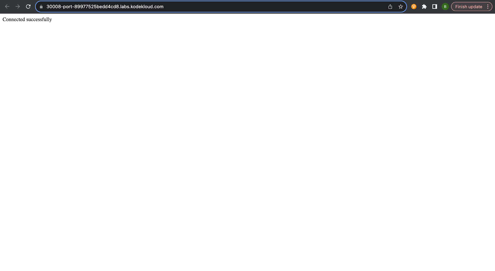

## TASK 
The task involved troubleshooting and resolving an issue with a LAMP (Linux, Apache, MySQL, PHP) environment deployed on a Kubernetes cluster. Specifically, a WordPress website that was previously functioning encountered problems, resulting in downtime. The objective was to investigate and rectify the issue to restore the website's functionality. 

## Solution
The following steps were undertaken to fix the issue:

1. Checked the website the see the error message

2. Verified the status of the pods associated with the deployment named "lamp-wp" and confirmed that they were running without any errors, ensuring the overall health of the environment.

3. Inspected the configuration of the service named "lamp-service" to ensure proper exposure on the correct port and node port. It was discovered that the node port was incorrectly set to 30009 instead of the expected 30008, causing connectivity issues which i then changed back to 30008.

4. Utilized the "kubectl describe" command to examine the environmental variables associated with the pods. These variables included MYSQL_ROOT_PASSWORD, MYSQL_DATABASE, MYSQL_USER, MYSQL_PASSWORD, and MYSQL_HOST.

5. Accessed the application container using the "kubectl exec" command to gain insights into the container's environment variables. A thorough comparison was made between the container's environment variables and the expected values, revealing a typographical error in 2 of the variables.

6. Rectified the typo in the respective environment variable, aligning it with the intended configuration. This ensured the correct connection parameters for the WordPress application to successfully connect with the database.

