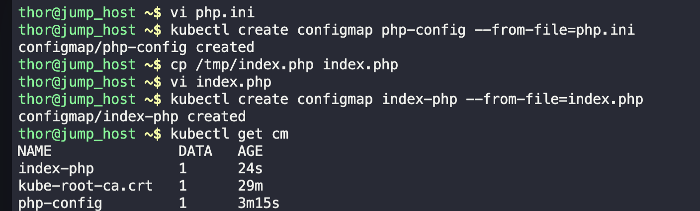
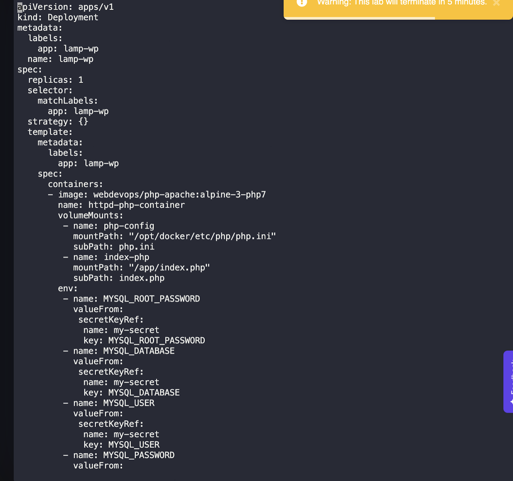
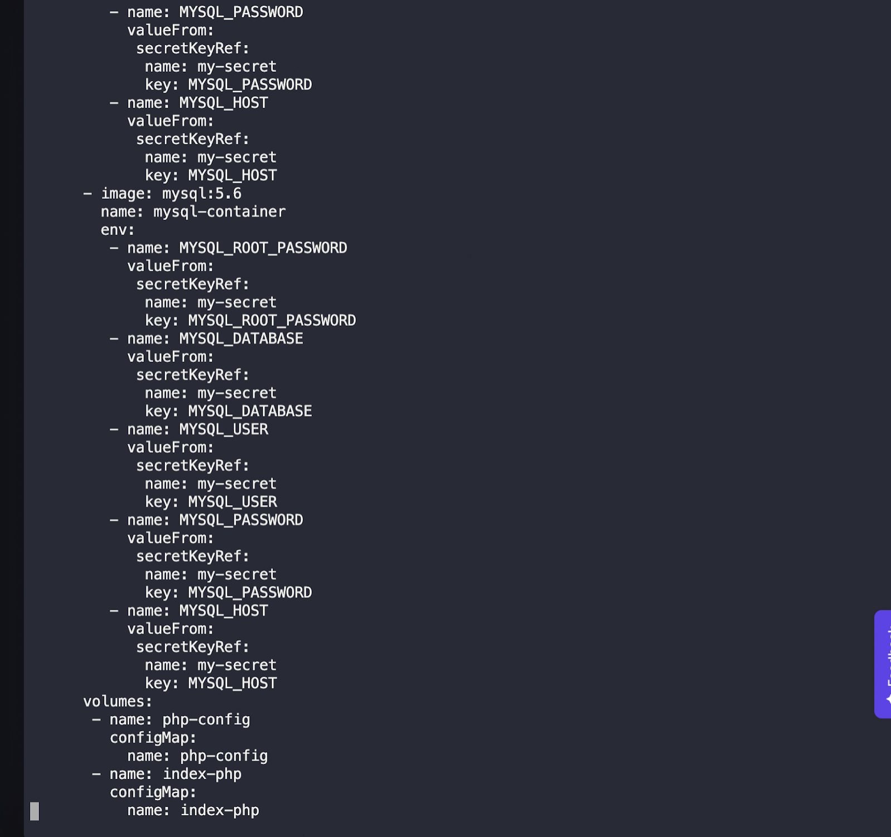
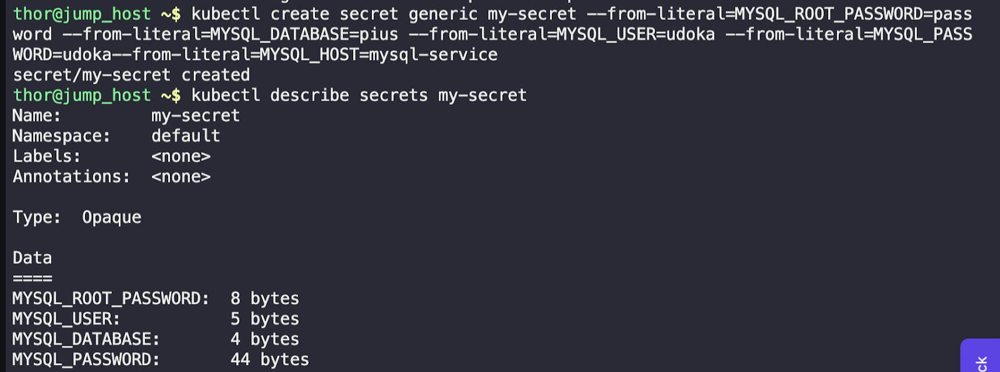
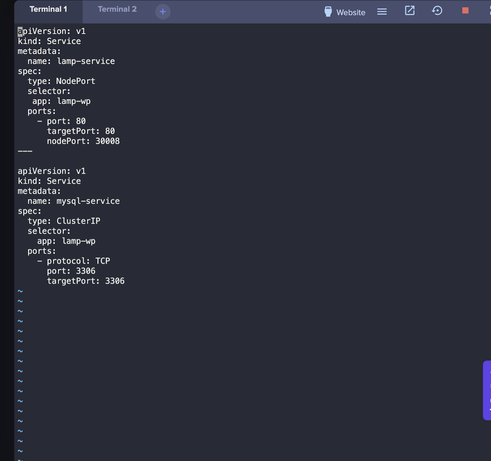
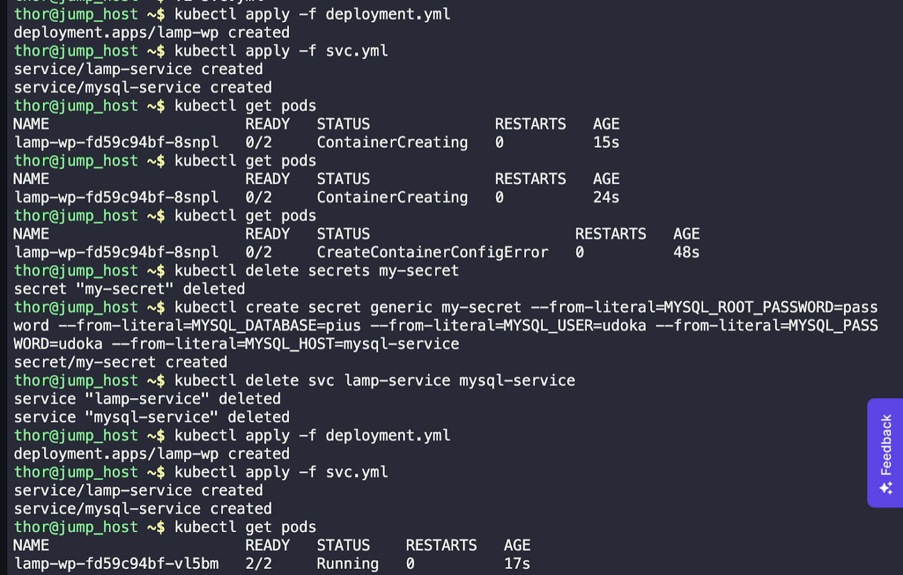
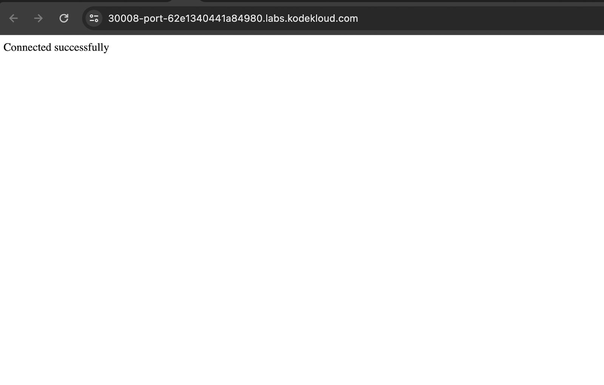

```markdown
# Kubernetes Task: LAMP Stack Deployment on Kubernetes Cluster 

## Task Requirements:
1. **Create a ConfigMap for php.ini**:
   - Configuration file `php.ini` should have `variables_order = "EGPCS"`.

2. **Create a Deployment named lamp-wp**:
   - Use replicas: 1.
   - Include two containers:
     - Container 1 (`httpd-php-container`) using the image `webdevops/php-apache:alpine-3-php7`.
     - Container 2 (`mysql-container`) using the image `mysql:5.6`.
   - Mount the `php-config` ConfigMap in `httpd-php-container` at `/opt/docker/etc/php/php.ini`.
 

3. **Create Kubernetes generic Secrets for MySQL**:
   - Include secret values for MySQL root password, user, password, host, and database.
   


4. **Add Environment Variables for both containers**:
   - For `httpd-php-container`, include environment variables: `MYSQL_ROOT_PASSWORD`, `MYSQL_DATABASE`, `MYSQL_USER`, `MYSQL_PASSWORD`, and `MYSQL_HOST`. Retrieve values from the created Secrets using `env` field.
   

5. **Create a NodePort type Service named lamp-service**:
   - Expose the web application on node port 30008.
  

6. **Create a Service for MySQL named mysql-service**:
   - Set the port to 3306.

7. **Copy /tmp/index.php into httpd container**:
   - Replace dummy values in `index.php` related to MySQL variables with the environment variables set in the deployment.

8. **Verify the Setup**:
   - Ensure the web application is accessible on node port 30008.
   - Check for a "Connected successfully" message when accessing the page.

## Solution:

### 1. Created ConfigMap for php.ini (php-configl), created file name php.ini and added the configuration to the file. 
```variables_order = "EGPCS"
```
kubectl create configmap php-config --from-file=php.ini
 


### 2.Created Deployment for lamp-wp (lamp-wp.yaml) using imperative method and edited the file.
 kubectl create deployment lamp-wp --image=webdevops/php-apache:alpine-3-php7 --replicas=1 -o yaml > deployment.yml :
```yaml
apiVersion: apps/v1
kind: Deployment
metadata:
  labels:
    app: lamp-wp
  name: lamp-wp
spec:
  replicas: 1
  selector:
    matchLabels:
      app: lamp-wp
  strategy: {}
  template:
    metadata:
      labels:
        app: lamp-wp
    spec:
      containers:
      - image: webdevops/php-apache:alpine-3-php7
        name: httpd-php-container
        volumeMounts:
         - name: php-config
           mountPath: "/opt/docker/etc/php/php.ini"
           subPath: php.ini
         - name: index-php
           mountPath: "/app/index.php"
           subPath: index.php
        env:
         - name: MYSQL_ROOT_PASSWORD
           valueFrom:
            secretKeyRef:
             name: my-secret
             key: MYSQL_ROOT_PASSWORD
         - name: MYSQL_DATABASE
           valueFrom:
            secretKeyRef:
             name: my-secret
             key: MYSQL_DATABASE
         - name: MYSQL_USER
           valueFrom:
            secretKeyRef:
             name: my-secret
             key: MYSQL_USER
         - name: MYSQL_PASSWORD
           valueFrom:
            secretKeyRef:
             name: my-secret
             key: MYSQL_PASSWORD
         - name: MYSQL_HOST
           valueFrom:
            secretKeyRef:
             name: my-secret
             key: MYSQL_HOST
      - image: mysql:5.6
        name: mysql-container
        env:
         - name: MYSQL_ROOT_PASSWORD
           valueFrom:
            secretKeyRef:
             name: my-secret
             key: MYSQL_ROOT_PASSWORD
         - name: MYSQL_DATABASE
           valueFrom:
            secretKeyRef:
             name: my-secret
             key: MYSQL_DATABASE
         - name: MYSQL_USER
           valueFrom:
            secretKeyRef:
             name: my-secret
             key: MYSQL_USER
         - name: MYSQL_PASSWORD
           valueFrom:
            secretKeyRef:
             name: my-secret
             key: MYSQL_PASSWORD
         - name: MYSQL_HOST
           valueFrom:
            secretKeyRef:
             name: my-secret
             key: MYSQL_HOST
      volumes:
       - name: php-config
         configMap:
           name: php-config
       - name: index-php
         configMap:
           name: index-php
```
  
   


### 3. Created Secrets for MySQL (my-secret) using imperative method.

```yaml
kubectl create secret generic my-secret --from-literal=MYSQL_ROOT_PASSWORD=password --from-literal=MYSQL_DATABASE=pius --from-literal=MYSQL_USER=udoka --from-literal=MYSQL_PASSWORD=udoka --from-literal=MYSQL_HOST=mysql-service
```
Mysql_host should be the mysql service name. 


### 4. Service for lamp (lamp-service) and Service for MySQL (mysql-service):
```yaml
apiVersion: v1
kind: Service
metadata:
  name: lamp-service
spec:
  type: NodePort
  selector:
   app: lamp-wp
  ports:
    - port: 80
      targetPort: 80
      nodePort: 30008
---
apiVersion: v1
kind: Service
metadata:
  name: mysql-service
spec:
  type: ClusterIP
  selector:
    app: lamp-wp
  ports:
    - protocol: TCP
      port: 3306
      targetPort: 3306
```
 


### TEST AND VALIDATE:
Add the /tmp/index.php to configmap and edit the connection string so the application can use the right variable to connect to the database mysql. Note to access the values of the SECRETS which is base64 encoded use this command ``` kubectl get secrets my-secrets -o jsonpath='{.data}' ```

 
  
