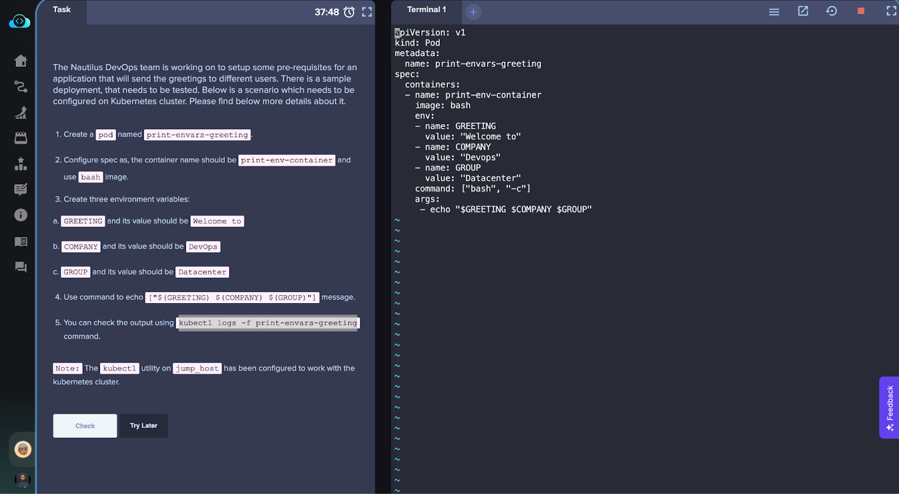

## Introduction
The Nautilus DevOps team worked on setting up pre-requisites for an application that sends greetings to different users. As part of this task, you created a pod named print-envars-greeting on a Kubernetes cluster and configured it to display a specific message using environment variables.

## Task Details
The task involved the following steps:

1. Created a pod named print-envars-greeting.
2. Configured the pod's spec with a container named print-env-container and used the bash image.
3. Defined three environment variables within the container:
   - GREETING: The value was set to "Welcome to".
   - COMPANY: The value was set to "xFusionCorp".
   - GROUP: The value was set to "Datacenter".
4. Used the echo command to display the message ["$(GREETING) $(COMPANY) $(GROUP)"].

## Apply 
Kubectl apply -f pod.yml 
## Verification
To verify the setup and check the output, you can use the following command:

kubectl logs -f print-envars-greeting

This command will display the logs of the print-envars-greeting pod, showing the message generated by the environment variables.

